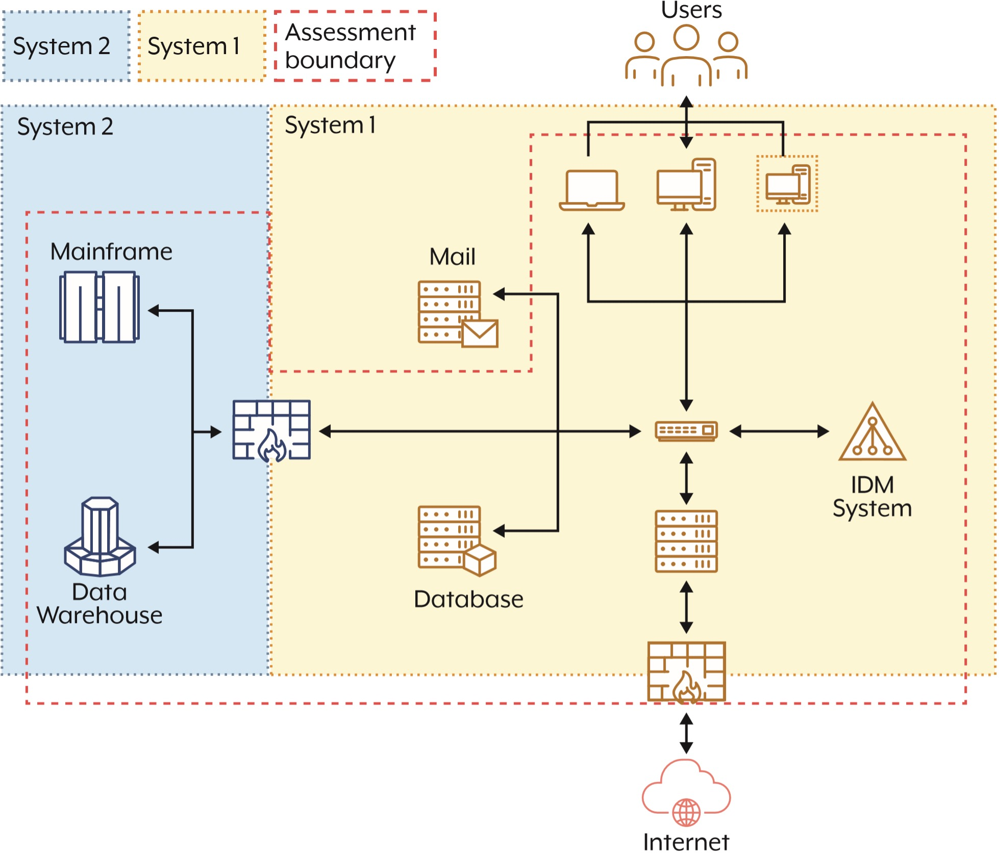
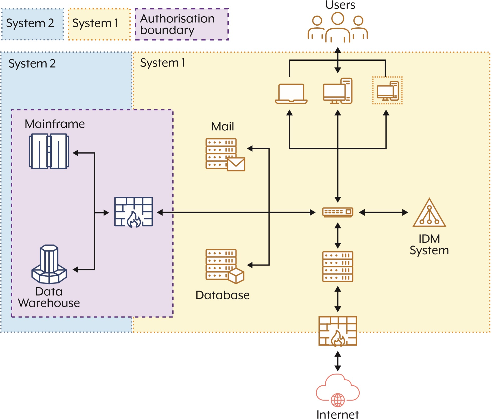
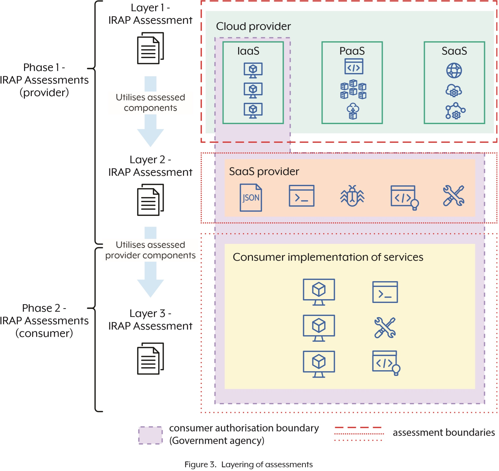

# IRAP Common Assessment Framework (April 2025)

## Executive summary

### Purpose

The IRAP Common Assessment Framework provides standardised methodologies and principles for assessing Information and Communication Technology (ICT) systems and services irrespective of the specific environment, such as a cloud service, gateway or an on premise system.

This document outlines the IRAP assessment process and key considerations during each stage. This document should be read in conjunction with other IRAP and ASD publications, including:

- [IRAP Policy and Procedures](IRAP%20Policy%20and%20Procedures%20(December%202020).md)
- [Cloud Security Guidance](https://www.cyber.gov.au/business-government/protecting-devices-systems/cloud-computing)
- [Gateway Security Guidance Package](https://www.cyber.gov.au/business-government/asds-cyber-security-frameworks/gateway-security-guidance-package)
- [IRAP Assessment Report Template](IRAP%20Assessment%20Report%20Template%20(February%202025).md)
- [Cloud Security Assessment Report Template](Cloud%20Security%20Assessment%20Report%20Template%20(July%202022).md)
- [IRAP Consumer Guide](IRAP%20Consumer%20Guide%20(July%202025).md).

### Intended Audience

The IRAP Common Assessment Framework is intended for use by IRAP assessors. Other IRAP-consuming entities may use this document to gain an understanding of the IRAP assessment process.

### Authority

The IRAP Common Assessment Framework is authorised by ASD and supported through IRAP Policy and Procedures. IRAP assessors are required to follow the processes outlined within this document when conducting IRAP assessments.

## Disclaimer

The methodologies and principles outlined within this document are intended to provide IRAP assessors with a standardised methodology for conducting an IRAP assessment. The information outlined enables a system agnostic approach to conducting cybersecurity assessments across various systems, services and architectures.

IRAP assessors are required to draw upon on their own unique experience and expertise in conjunction with ASD’s IRAP Common Assessment Framework, to assess systems and apply the intent of the Information Security Manual to unique systems and environments. Assessors should ensure sufficient coverage and depth of assessment objects, controls and scope.

## IRAP assessment

### Overview

The Australian Signals Directorate (ASD), via the Infosec Registered Assessors Program (IRAP), provides organisations with access to cybersecurity professionals to conduct high quality, independent security assessment services.

An IRAP security assessment helps organisations understand their system’s security strengths and weaknesses and provides recommendations that can be utilised as part of their organisational security program.

IRAP assessors do not accredit, certify, endorse or register systems on behalf of ASD, the assessed entity, or the consuming agency. IRAP assessors work to understand the system and outline security strengths and weakness by assessing the effectiveness of controls implemented.

The approach to conducting an IRAP assessment varies based on the size, complexity and type of system. However, there are fundamental assessment stages and principles that must be applied to every assessment to ensure IRAP assessments are objective, independent and meet the expectations of ASD. IRAP assessors develop documents that equip an authorising officer to make an informed risk-based decision on whether to authorise a system or service for use within an organisation.

The minimum deliverables of an IRAP assessment that an IRAP assessor will develop and make available to the assessed entity are:

- IRAP Security Assessment Report or IRAP Cloud Security Assessment Report; which is intended to be read by authorising officers, system owners and risk owners;
- Controls Matrix or Cloud Controls Matrix; which is intended to be read by technical personnel and system administrators responsible for integrating the assessed system into their organisation.

IRAP assessors may develop additional documents to assist them during an assessment, such as an IRAP security assessment plan.

### IRAP Assessment standards

IRAP assessors are required to meet quality standards specified within the IRAP Quality Assurance Framework that form the minimum requirements. The IRAP Common Assessment Framework breaks down the quality standards into individual IRAP Assessment Requirements (IRAP-AR). The quality standards are:

- **Report quality and terminology:** The outputs developed by the IRAP assessor are detailed, accurate and aligned to ASD’s published guidance and frameworks.
- **Assessment process and frameworks:** The IRAP assessment follows the approach and processes outlined within this document and considers other Australian Government frameworks and policies.
- **Evidence gathering:** The evidence gathered during an assessment is of sufficient quality and sampled appropriately for the system context, control and timeframe.
- **Coverage:** The IRAP assessor ensures sufficient coverage of the assessment and components that are out of the assessment boundary are clearly articulated and justified.
- **Objectivity:** The IRAP assessor presents unbiased, evidence-based findings that are substantiated with sufficient quality evidence at the time of the assessment.
- **Technical accuracy and completeness:** The IRAP assessor has a strong technical understanding of the assessed system and is able to determine and articulate the effectiveness of a control.
- **Assessment integrity:** IRAP assessors maintain independence and report on any circumstances that could impede independence.

### Boundary definitions

**Assessment boundary** – The assessment boundary is all components of an information system to be assessed in scope of the assessed entities Information Security Continuous Monitoring (ISCM) implementation. The assessment boundary includes associated assessment objects (specifications, mechanisms and activities) to which evaluations are applied.

The assessment boundary is typically defined by the IRAP assessor and agreed to by the assessed entity’s delegate authority.

**Authorisation boundary** – The authorisation boundary includes all components of an information system to be authorised for operation by an authorising authority, and may exclude separately authorised systems to which the system is connected.

Authorising officers may choose to authorise a number of provider’s services that are less than the total number of services that have been assessed by an IRAP assessor. In some cases, the authorisation boundary may match, or be a smaller rendition of, the assessment boundary. However, the authorisation boundary should not be larger than the assessment boundary (the authorisation boundary may include an amalgamation of assessment boundaries but will not be larger than that collection).

The authorising officer is responsible for authorising systems and services for operation within their organisation.

### Layering IRAP assessments

Depending on the assessed entity and service, IRAP assessments may be layered. This requires additional considerations when assessing a system that is dependent upon a preceding layer that has been assessed. An example of layering is provided below:

- **Layer 1 (Cloud infrastructure provider)** - This security assessment covers the infrastructure layer and the responsibilities of the cloud infrastructure provider in managing the infrastructure layer.
- **Layer 2 (Software as a Service (SaaS) provider)** This security assessment covers the Software-as-a- Service (SaaS) layer and specifies the responsibilities of the SaaS provider. It should also link to the infrastructure security assessment by including key considerations provided within that layer’s IRAP Security Assessment Report.
- **Layer 3 (Consumer government agency)** - This security assessment covers the security responsibilities of the consumer. It should also leverage the IRAP Security Assessment Reports from the preceding 2 layers to provide the relevant information to the authorising officer in a single report.

Depending on a provider or a consumer’s implementation of services, the layers may vary. Where a consumer does not utilise a SaaS provider, there may only be two layers present (Cloud infrastructure provider to government). Alternatively, where a consumer (government agency) also provides services to other government agencies (government to government) in addition to a SaaS provider, there may be an additional layer.

### When to use sampling

IRAP assessments do not generally cover an entire environment, they are focused on systems and services. As a result, most controls should be directly assessed for all components within the assessment boundary. Sampling involves leaving out some number of components on the basis that the sample accurately reflects the sum of them. It is important that sampling is only used to support direct control assessments, not to exclude components that require individual evaluation.

Sampling may be required to support an accurate determination of the effectiveness of certain controls. For example, the assessor will sample historical application of processes, such as patching, to gain assurance that they are regularly followed, or may sample a number of servers to ensure that they are enrolled in an upstream deployment mechanism, such as Group Policy Objects (GPO) configurations or Infrastructure as Code (IaS) deployments.

Where sampling is required, IRAP assessors must carefully consider the sample size and methodology to employ during an assessment. These factors afford assessors the opportunity to gather an appropriate body of high-quality evidence; enabling assessors to draw valid conclusions regarding the effectiveness of controls. The selection of an optimal sample size should align with the scale of the system or service under assessment. In cases where achieving an appropriate sample size is not possible, it is important that assessors outline this constraint and the impact within the IRAP report.

It is incumbent upon the IRAP assessor to exercise their judgement in determining the appropriateness of employing sampling techniques. The choice of sampling method will depend on the system, control, available resources, and the nature of the population being assessed. Each method has its advantages and limitations. The selection should be made carefully to ensure the assessment is effective and representative.

---

- **IRAP-AR-0001 | Evidence gathering | Apr 2025**
    
    The IRAP assessor has assessed all components within the assessment boundary and has used sampling only where appropriate, to determine control effectiveness.

---

Examples of assessment objects for sampling:

- Generated logs, the details contained in the log files and the retention.
- The development, maintenance and implementation of different system administration procedures.
- System configurations and control mechanisms that are not managed by a central upstream service.
- Organisation’s staff understanding of cybersecurity training, awareness and organisational policies.
- Historic application of patches and their associated timeframes.
- On boarding of personnel.

IRAP assessors should leverage the following sampling principles when determining their approach:

- **Level of standardisation:** Many ICT environments are centrally managed. For example, when checking the validity of server configurations that are configured using a single technical policy, one server may be representative of all systems.
- **Representative:** IRAP assessors need to ensure that any points they sample are representative, and not an example created only for assessment purposes. This includes collecting historical evidence to determine an appropriate and consistent conclusion. For example, collecting historical evidence of system patching to determine whether the assessed entity demonstrates consistent patching, or only prior to an assessment.
- **Ease of data collection:** IRAP assessors may leverage tools approved by the assessed entity as part of their assessment; driving down effort of each individual sample and enabling automation of collection of evidence for large-scale systems. This allows the Assessor to gather evidence that will lead to a more accurate assessment.
- **Confirmation of unexpected results:** IRAP assessors may identify results that are inconsistent with their professional experience, such as an assessed entity demonstrating significant over or underperformance against assessment criteria relative to other similar assessed entities. In these situations, IRAP assessors should determine how to collect additional samples to confirm the unexpected result.

---

- **IRAP-AR-0002 | Evidence gathering | Apr 2025**
    
    The IRAP assessor clearly explains the sampling methodology; outlining any disadvantages, advantages and why it was chosen.

---

IRAP assessors may consider utilising some of the following sampling methodologies examples (not exhaustive). Additionally, they may utilise sampling methodologies from the Australian Government Auditing and Assurance Standards Board (AuASB) auditing standard – ASA 530 Audit Sampling:

#### **Sampling methods**

1. **Random sampling** – Method of selecting a sample at random, reducing bias selection. However, the risk of this approach is the Assessor may miss particular sample sets with certain characteristics.
2. **Stratified sampling** – Method of sampling assessment objects into distinct subgroups based on specific criteria. Samples are then taken from each stratum in proportion to its significance.
3. **Risk-based sampling** - Method of using a combination of the probability of occurrence and the severity of that harm to determine a representative sample that would cause the organisation the most risk. This method requires input from the assessed entity’s delegate to provide enough organisational context to determine systems that have a higher risk or require prioritisation.  
The use of threat modelling may be used to inform the sampling methodology.
4. **Systematic sampling** – Method of sampling assessment objects at regular intervals from a sorted group. An example is reviewing every 2nd user account.

### Implementation outcomes

IRAP assessors must use ASD’s standardised terminology when determining control implementation effectiveness; using their qualitative judgement that is strongly informed by quantitative assessment objects. ASD’s standardised terminology is defined within the ISM and the associated control matrix and outlined below:

- **Effective**: The organisation’s control implementation is effectively meeting the intent of the ISM’s control objective.
- **Ineffective**: The organisation’s control implementation is not adequately meeting the intent of the ISM’s control objective.
- **Alternate control:** The control implementation is meeting the intent of the ISM’s control objective through an alternate control.
- **Not assessed:** The control has not yet been assessed by the IRAP assessor.
- **Not applicable**: The control does not apply to the system or environment.
- **No visibility:** The IRAP assessor was unable to obtain adequate visibility or assurance of a controls’ implementation. The utilisation of ‘No visibility’ may be considered as a control being ‘ineffective’ from a risk perspective, for authorising officers.
- **Not implemented:** The organisation has not implemented the ISM control - generally due to business or technical constraints. Controls assessed as ‘Not implemented’ should be accompanied with the associated business decision or technical constraint within the report, where appropriate.

All control assessments, including not applicable and not implemented, must be accompanied by a justification for that status, written by the IRAP assessor.

---

- **IRAP-AR-0003 | Report quality and terminology | Apr 2025**
    
    The IRAP assessor uses the correct terminology and intent for assessing control implementation; defined by ASD.

---

### Examples for determining control effectiveness

#### Example of effective control implementation

***Control: ISM-1654; Revision: 0; Updated: Sep-21; Applicability: NC, OS, P, S, TS; Essential Eight: ML1, ML2, ML3** Internet Explorer 11 is disabled or removed.*

During an IRAP assessment, the IRAP assessor identified that the organisation has implemented the control using application control policies using allow lists. To confirm the control effectiveness, the IRAP assessor attempted to access Internet Explorer 11 by clicking the .exe icon on the desktop and through control panel applets. Each attempt resulted in the IRAP assessor receiving a blocked message from the application control software.

In this case, the assessment outcome is **‘effective’** as the application control policies effectively disables Internet Explorer 11 from executing on the system.

#### Example of ineffective control implementation

***Control: ISM-1654; Revision: 0; Updated: Sep-21; Applicability: NC, OS, P, S, TS; Essential Eight: ML1, ML2, ML3** Internet Explorer 11 is disabled or removed.*

During an IRAP assessment, the IRAP assessor identified that the organisation has implemented the control through computer policies. To confirm the control effectiveness, the IRAP assessor attempted to access Internet Explorer 11 by clicking the .exe icon on the desktop, which resulted in a blocked message. However, the IRAP assessor then attempted to access the web browser through another mechanism using control panel applets, resulting in Internet Explorer 11 executing on the system.

In this case, the assessment outcome is **‘ineffective’** as the computer policies configured did not effectively disable or remove Internet Explorer 11, resulting in its execution on the system.

#### **Example of alternate control implementation**

***Control: ISM-1695; Revision: 2; Updated: Dec-23; Applicability: NC, OS, P, S, TS; Essential Eight: ML1, ML2** Patches, updates, or other vendor mitigations for vulnerabilities in operating systems of workstations, noninternet-facing servers and non-internet-facing network devices, are applied within one month of release.*

During an internal review, an organisation identified a low-risk Microsoft Windows server that could not be patched. As a result, the organisation implemented a plan to decommission the server within two months.

Prior to decommissioning the server, it is placed in a segmented domain with extensive monitoring and policy enforcements to prevent and log any known vulnerable ports or services that attempted to communicate with the server until it is decommissioned.

In this case, the assessment outcome is **‘alternate control’** as the organisations implementation includes strong compensating controls.

#### Example of not applicable control implementation

***Control: ISM-1622; Revision: 0; Updated: Oct-20; Applicability: NC, OS, P, S, TS; Essential Eight: ML3** PowerShell is configured to use Constrained Language Mode.*

During an IRAP assessment, the IRAP assessor identified, through technical validation and conducting interviews with the system owner, that the system uses an operating system that does not contain or support PowerShell. In addition, the IRAP assessor reviewed the application control allow lists and noted that PowerShell was not included.

In this case, the assessment outcome is **‘not applicable’** as the IRAP assessor was able to identify and confirm that PowerShell was not installed or utilised on the operating system. The assessor then noted the findings in the report with a clear rationale as to why the control was not applicable to the assessment boundary.

#### Example of no visibility control implementation

***Control: ISM-0840; Revision: 4; Updated: Jun-22; Applicability: OS, P, S; Essential Eight: N/A** When outsourcing the destruction of media storing non-accountable material, a National Association for Information Destruction AAA certified destruction service with endorsements, as specified in ASIO’s Protective Security Circular-167, is used.*

During an IRAP assessment, an IRAP assessor is validating whether the outsourcing of destruction of media by a provider, is using a certified destruction service specified in ASIO’s Protective Security Circular-167. The IRAP assessor noted the destruction service vendors used by the provider, however, was not able to gain access to ASIO’s Protective Security Circular-167 publication. As such, the IRAP assessor was unable to determine whether the control was effective or ineffective.

In this case, the assessment outcome is **‘no visibility’** as the IRAP assessor was not able to verify the implementation of a control due to a constraint in the assessment. The IRAP assessor noted the limitation in the report and provided a recommendation to consuming agencies to review the outsourced destruction services against ASIO’s Protective Security Circular-167.

**Note**: The ‘no visibility’ status in some instances, could be considered as ‘not implemented’ or  ‘ineffective’, from a risk perspective, by consumers of the IRAP assessment report, depending on the  nature of the no visibility.

#### **Example of not implemented control implementation**

***Control: ISM-1874; Revision: 1; Updated: Dec-23; Applicability: NC, OS, P, S, TS; Essential Eight: ML3** Multifactor authentication used for authenticating customers of online customer services is phishing-resistant.*

During an IRAP assessment, the IRAP assessor confirmed through technical testing and discussions with the system owner, that phishing-resistant Multi-factor authentication is not implemented due to a business decision. The IRAP assessor requested the documentation and the delegated authority accepting the risk of the absence of phishing-resistant MFA. The delegated authority outlined that they accept the risk of not implementing phishing-resistant MFA due to a variety of customers not having access to modern authentication methods available to authenticate. The IRAP assessor outlines these constraints in the IRAP assessment report.

In this case, the assessment outcome is **‘not implemented’** as the IRAP assessor confirmed, through testing and discussions with the appropriate authority, the informed decision to not implement the control.

### Quality of evidence

Access to evidence, as well as the quality of evidence provided during an IRAP assessment, affects an IRAP assessor’s ability to determine the implementation effectiveness of a control. The nature of the control may affect the IRAP assessor’s ability to obtain certain types of evidence. IRAP assessors should consider the following examples and definitions of excellent, good, fair and poor evidence and aim for the best evidence available for a given control:

- **Excellent evidence:** The IRAP assessor is able to examine, test or review firsthand, the activities, processes or mechanisms that demonstrate the control is in operation.
    - Testing the control with a simulated activity designed to confirm it is in place and effective (e.g. attempting to run an application to check for application control, or attempting to access an external website using a privileged account).
- **Good evidence**: The IRAP assessor is able to review a variety of sources that evidence the existence of activities, processes or mechanisms, which demonstrate the control is likely still in operation.
    - Reviewing the technical configuration of the system (through the systems’ interface) to determine whether it should enforce the expected policy.
- **Fair evidence:** The IRAP assessor receives second hand evidence of a process, activity, or mechanism that demonstrates the control has been implemented.
    - Reviewing a copy of the relevant system’s configuration to determine if it should enforce the expected policy.
- **Poor evidence:** The IRAP assessor reviews evidence from personnel or specifications outlining statements of implementation, activities, processes or mechanisms that asserts the existence of the control.
    - A policy statement that repeats the ISM control in an internal document, irrespective of the amount of information included. Another example of poor evidence is verbal confirmation that a control has been implemented.

---

- **IRAP-AR-0004 | Objectivity | Apr 2025**
    
    The IRAP assessor has based the assessment on presented evidence and facts and has not made inappropriate assumptions.

---

IRAP assessors should ensure the evidence gathered and the assessment degree (depth and coverage) supports an accurate assessment of a control. Assessors should discuss evidence, coverage and depth expectations with the assessed entity to identify areas in which they should prioritise control testing and to conduct deeper analysis.

---

- **IRAP-AR-0005 | Evidence Gathering | Apr 2025**
    
    The IRAP assessor gathers evidence that is at a sufficient quality and is appropriate for the system and control being assessed.

---

If the evidence available does not adequately support the accurate determination of control effectiveness, the IRAP assessor must document this limitation within the Security Assessment Report and controls matrix. In some instances, the IRAP assessor may consider the use of no visibility. The IRAP assessment report must outline the lack of information, evidence, or methodologies due to assessment constraints, to enable consumers to make a risk-based decision to authorise a system.

---

- **IRAP-AR-0006 | Report quality and terminology | Apr 2025**
    
    The IRAP assessment report clearly articulates any constraints or limitations affecting the assessment, and their impacts.

---

#### Examples for evidence collection

***Control: ISM-1622; Revision: 0; Updated:*** 
***Oct-20; Applicability: NC, OS, P, S, TS; Essential Eight: ML3** PowerShell is configured to use Constrained Language Mode.*

- **Excellent evidence:**
    
    The IRAP assessor tested the control by running a command in PowerShell (version 7.4) that requires full language mode on a production end user device running in its default executable mode.
    
    `[System.Console]::WriteLine(“Hello”)`
    
    Upon executing the command, the IRAP assessor receives an output within PowerShell advising that constrained language mode is required to run the above command.
    
- **Good evidence:**
    
    The IRAP assessor ran a PowerShell command that outlines the current language mode.
    
    `$ExecutionContext.SessionState.LanguageMode`
    
    This is considered Good evidence as the IRAP assessor examines the configuration of PowerShell but does not actively test to determine expected or unexpected results.
    
- **Fair evidence:**
    
    The IRAP assessor received a screenshot of the administrator’s screen that outlines that PowerShell is in constrained language mode.
    
- **Poor evidence:**
    
    The IRAP assessor reviewed the System Security Plan (SSP) that stated that PowerShell is configured with constrained language mode.
    
    During an interview with the system administrator they advised that PowerShell is configured with constrained language mode.
    

***Control: ISM-0272; Revision: 4; Updated: Mar-19;*** 
***Applicability: NC, OS, P, S, TS; Essential Eight: N/A** Protective marking tools do not allow users to select protective markings that a system has not been authorised to process, store, or communicate.*

- **Excellent evidence:**
    
    The IRAP assessor attempts to change the protective markings to a higher classification than authorised by the system.
    
- **Good evidence:**
    
    The IRAP assessor reviews the configuration of the protective marking tool.
    
- **Fair evidence:**
    
    A screenshot is provided of the configuration of the protective marking tool.
    
- **Poor evidence:**
    
    The IRAP assessor reviews the design document of the protective marking tool which states that the tool does not allow users to select a classification that is not authorised for the system.
    

### Providing recommendations

IRAP assessors provide recommendations as part of the assessment within the IRAP assessment report. The IRAP assessor must not design or dictate the manner in which a recommendation is addressed. Assessors should focus on providing descriptive recommendations that clearly outline the intent so organisations are able to use a risk-based approach to decide how they will meet the intent through the implementation of controls. It should describe the issue, explaining its implications, and provide insights using best practice that organisations can consider, when determining how to address the issue.

| **Descriptive recommendations examples** | **Prescriptive recommendations examples** |
| --- | --- |
| The organisation should implement Just-In-Time access for their cloud-privileged accounts. | The organisation needs to upgrade their Azure licence to P2 from free and implement Just-In-Time access for their privileged accounts with a 4-hour window. |
| The organisation should review their allowed applications to determine if they are still required by the organisation and utilised by their personnel. | The organisation must implement application control allow rules for the following applications:  - X application  - Y application  - Z application |

#### Consumer recommendations

When assessing a service that government entities are seeking to authorise within their agency, IRAP assessors should request recommendations for consumer implementations from the provider. The assessor should check these recommendations to ensure they are effective in meeting their intent. These consumer recommendations should be included within the IRAP assessment report to provide government agencies with actionable insights and controls to ensure their chosen service aligns with their unique security and organisational requirements.

Consumer recommendations may include the following:

- The service provider allows consumers to configure a ‘lockbox’ mechanism, which prevents provider administrators’ access to the government entity’s data unless explicitly authorised.
- The service provider allows consumers to configure a ‘region lock’ control that prevents all data from being sent off shore from Australia.

---

- **IRAP-AR-0007 | Report quality and terminology | Apr 2025**
    
    The IRAP assessor gathers consumer recommendations from the provider, evaluates and includes them in the relevant section of the report.

---

## IRAP Assessment Stages

The IRAP assessment process contains four key stages:

1. Plan and prepare
    
    The IRAP Assessor conducts planning and preparing activites prior to commencing an assessment, such as advising ASD IRAP.
    
2. Define the assessment boundary
    
    The IRAP Assessor works with the assessed entity to define the scope of the assessment and identifies assets to be included.
    
3. Assess the controls
    
    The IRAP Assessor assesses the controls implemented within the organisation against the Information Security Manual.
    
4. **Produce the** IRAP assessment report
    
    The IRAP Assessor produces the IRAP assessment report and the control matrix outlining the findings and any recommendations.
    

### Stage 1: Plan and prepare

Comprehensive planning and preparation is a crucial step that offers benefits to both the assessor and the assessed organisation. It helps define assessment objectives, establish an assessment team and identify information sources that play a pivotal role through the assessment process. With this information identified, the assessment is well positioned for efficiency and success.

IRAP assessors are required to inform the ASD IRAP Administration team of their intention to conduct an IRAP assessment by submitting an IRAP assessment engagement form on the Partner Portal, which also includes a Conflict of Interest (COI) declaration.

---

- **IRAP-AR-0008 | Assessment Integrity | Apr 2025**
    
    IRAP assessors submit a Conflict of Interest declaration to ASD IRAP prior to commencing an IRAP assessment.

---

To ensure ASD is able to manage COI’s effectively and provide recommendations, IRAP assessors must provide sufficient time, prior to the commencement of the engagement, for ASD to review and assess the submitted conflict. For further information regarding the COI process, IRAP assessors can reach out to ASD IRAP at  `asd.irap@defence.gov.au`.

---

- **IRAP-AR-0009 | Assessment Integrity | Apr 2025**
    
    The conflict of interest declaration is submitted at least 7 business days prior to the commencement of the IRAP assessment.

---

Throughout an IRAP assessment, conflict of interests can evolve due to new information being discovered, or changes in roles, scope or relationships. As such, these situations could compromise the independence of an IRAP assessor. Where changes in actual or perceived conflict of interest status are identified, IRAP assessors are required to update their COI declaration as soon as possible.

---

- **IRAP-AR-0010 | Assessment Integrity | Apr 2025**
    
    IRAP assessors update and maintain their conflict of interest declaration throughout the IRAP assessment and inform ASD IRAP of any changes.
    

- **IRAP-AR-0011 | Assessment Integrity | Apr 2025**
    
    The report outlines all nature of conflicts of interest for authorising officers.

---

During engagement-planning activities, and in consultation with the client, the assessor is required to determine:

- Assessment start date, expected end date, and milestones.
- Access to resources required to undertake the assessment, which may include documentation, system accounts, tools, personnel and facilities. Documents may include, but are not limited to:
    - System Security Plan (SSP) and annex;
    - Risk management documents;
    - Design and architectural documents;
    - Incident response plans and playbooks;
    - Organisational policies;
    - Standard Operating Procedures (SOP);
    - Security test cases and test plans;
    - Business Continuity Plans (BCP) and Disaster Recovery Plans (DRP);
    - Functional and non-functional requirements;
    - Configuration and build documents; and
    - DevSecOps documents (including pipeline).
- Intended methodologies to be used during the assessment (i.e. sampling, evidence gathering or testing).
- System and control testing activities that will be conducted during the assessment.
- Evidence collection processes and protection, including requirements following the conclusion of an IRAP assessment.
- Whether managed service providers or other outsourced providers manage any aspect of the system, and include appropriate points of contact
- Frameworks and policies that could be applicable to the system or environment. These may include:
    - [Hosting Certification Framework (HCF)](https://www.hostingcertification.gov.au/)
    - [Security Construction and Equipment Committee (SCEC) assessment](https://www.scec.gov.au/)
    - [Protective Security Policy Framework (PSPF)](https://www.protectivesecurity.gov.au/).
- Appropriate use and marketing of the IRAP assessment and artefacts
- Communicate the expectations of what is and is not the purpose of an IRAP assessment
- Availability of IRAP artefacts and the need to provide evidence to ASD for quality assurance purposes
- Identify the required skills and knowledge to effectively assess the environment and build the assessment team

IRAP assessors may develop an IRAP assessment plan to document this information and share with the client organisation.

---

- **IRAP-AR-0012 | Assessment process and frameworks | Apr 2025**
    
    The IRAP assessment utilises necessary Australian Government cybersecurity frameworks, policies and guidance relevant to the assessed entity and system, including but not limited to, the ISM and PSPF.
    

- **IRAP-AR-0013 | Assessment process and frameworks | Apr 2025**
    
    The IRAP Assessment report clearly articulates activities conducted during each stage of the IRAP assessment.

---

IRAP assessors must use the latest version of the ISM when beginning an assessment. If, during the assessment, a new version of the ISM is released, the assessor in agreement with the organisation, may choose to switch to the latest version. An assessment underway must not be more than one version behind the current ISM i.e. if an assessment is long enough that two releases of the ISM have occurred during the assessment, the assessor must switch to the latest.

---

- **IRAP-AR-0014 | Assessment process and frameworks | Apr 2025**
    
    IRAP assessors use the latest release of the ISM available prior to the beginning of the IRAP assessment.
    

- **IRAP-AR-0015 | Assessment process and frameworks | Apr 2025**
    
    Where the time taken to complete an assessment lapses 2 releases of the ISM, the assessor has conducted a delta assessment against the current version of the ISM.

---

#### IRAP security assessment team

Depending on the scope and architecture that is being assessed, the IRAP assessor may consider developing a security assessment team. By forming a security assessment team, it enables the IRAP assessor to be supported through a variety of skillsets to assist in forming a cohesive assessment.

In these cases, IRAP assessors should ensure they are supported by a sufficiently diverse and sufficiently skilled team to assist with the assessment, including in understanding and interpreting evidence that will be reviewed as part of the assessment.

---

- **IRAP-AR-0016 | Technical accuracy and completeness | Apr 2025**
    
    When the IRAP assessor does not have a sound technical understanding of a component or technology within the assessed system, they are sufficiently supported by a security assessment team with the technical expertise and knowledge of the system or technology.

---

### Stage 2: Define the assessment boundary

Defining the assessment boundary for an IRAP assessment has a multifaceted impact on the assessment process. The IRAP assessment boundary should be defined by the IRAP assessor in agreement with the organisation’s delegate. There may be cases where the assessment boundary is an iterative process and may evolve as new information is available, or as the assessment progresses. The IRAP assessor should regularly review and validate the assessment boundary (with the organisation’s delegate) to ensure it remains relevant and aligned with the assessment objectives.

---

- **IRAP-AR-0017 | Coverage | Apr 2025**
    
    The IRAP assessor regularly reviews, validates, and maintains the assessment boundary.

---

A well-defined assessment boundary ensures that the organisation’s delegate and the IRAP assessor share a common understanding of the assessment boundary and architecture.

IRAP assessors should consider the following information when determining the assessment boundary:

- the system boundaries (version and environments under assessment e.g. PROD, PRE-PROD, TEST or DEV and the implications of the latter)
- identify the intended security and control classification of the data stored, processed or communicated by the system and for the assessment.
- the components that make up the assessment boundary of the system (i.e., the system components under assessment, as well as the people, processes, technologies and facilities that the system relies on or affect its security posture)
- the service providers corporate network may be in scope, depending on secure administration practices and segmentation and segregation between the corporate network and the service provider’s cloud infrastructure. IRAP assessors will need to consider the End User Computing (EUC) devices that are used to perform privileged activities, as jump servers cannot adequately protect the exposure to the underlying devices.
- previous assessments conducted that may assist in defining the assessment boundary
- identification of assets, components, applications, networks, data and physical facilities. The IRAP assessor should be explicit about what is and is not within the assessment boundary
- gain an understanding of the system, including its function, processes, data, users, architecture and technology stack
- identify the parties (including suppliers) involved in delivering or maintaining the system and its controls. This includes identifying the shared responsibility model and control inheritance
- use the SSP annex, CCM (if available) and logical system diagrams to identify the controls applicable to the system boundary

---

- **IRAP-AR-0018 | Coverage | Apr 2025**
    
    The IRAP assessment report clearly defines the assessment boundary.
    

- **IRAP-AR-0019 | Coverage | Apr 2025**
    
    The IRAP assessment report covers aspects regarding data sovereignty, offshore equipment and staff, or any information (including metadata) that is not within Australia.

---

The assessed organisation may already have a view of the assessment boundary, however it is the IRAP assessor’s responsibility to validate the appropriateness of the boundary.

Inclusions and exclusions within the assessment boundary need to be clearly articulated within the IRAP assessment report. Any system components or environments deemed not applicable, should be clearly documented and accompanied by strong justifications for their exclusion from the assessment.

---

- **IRAP-AR-0020 | Coverage | Apr 2025**
    
    The IRAP assessment covers all applicable environments, software, workstations, network devices, servers and other devices or services within the assessment boundary.
    

- **IRAP-AR-0021 | Coverage | Apr 2025**
    
    The rationale for controls, systems and architecture that are out of scope, is clearly articulated within the IRAP assessment report and control matrix.

---

### Stage 3: Assess the controls

In this stage, the IRAP assessor collects and reviews evidence to determine the implementation effectiveness of controls against relevant Australian Government frameworks and policies. The assessor will assess the system holistically; tying assessment findings to ISM principles, where applicable.

---

- **IRAP-AR-0022 | Assessment process and frameworks | Apr 2025**
    
    The IRAP assessment follows the methodologies and approaches outlined in the IRAP Common Assessment Framework; building upon the process where necessary.

---

The IRAP Common Assessment Framework draws upon similar terminology utilised within the United States (US) National Institute of Standards and Technology (NIST) Special Publication (SP) 800-53Ar5 – Assessing security and privacy controls.

Assessment objects identify specific items being assessed as part of a given control, and include system specifications, control mechanisms, activities and personnel.

- **Specifications** are document-based artefacts, such as policies, procedures, plans, functional and nonfunctional requirements, or architectural designs associated with a system or common control.
- **Mechanisms** are software, hardware or firmware safeguards or countermeasures implemented, such as application control, or access control, employed within a system or common control.
- **Activities** are specific procedures conducted in performing operational-related activities, such as conducting system backups, analysing and monitoring traffic that involve people.
- **Personnel** are the individuals implementing, developing, or maintaining, the specifications, mechanisms, or activities within the system or environment, as described above.

Assessment methods includes:

- **Examine** – The process of checking, inspecting, reviewing, observing, studying, or analysing one or more assessment objects to facilitate understanding, achieve clarification, or obtain evidence; the results of which are used to support the determination of security and privacy control existence, functionality, correctness, completeness, and potential for improvement over time.
    - The IRAP assessor examines assessment objects, such as the specification (e.g., policies, plans, procedures, system requirements, and designs), mechanisms (functionality implemented in hardware, software, and firmware) and activities (system operations, administration, management, exercises).
- **Interview** – The process of conducting discussions with individuals or groups within an organisation to facilitate understanding, achieve clarification, or lead to the location of evidence; the results of which are used to support the determination of security and privacy control existence, functionality, correctness, completeness, and potential for improvement over time.
    - The IRAP assessor interviews individuals or groups of individuals, such as training officers, system owners, administrative staff, physical security officers, or end users.
- **Test** – The process of exercising one or more assessment objects under specified conditions to compare actual with expected/desired behaviour, the results of which are used to support the determination of security and privacy control existence, functionality, correctness, completeness, and potential for improvement over time.
    - The IRAP assessor may tests mechanism (hardware, software, firmware) and activities (system operations, administration or management)

---

- **IRAP-AR-0023 | Report quality and terminology | Apr 2025**
    
    The IRAP assessor only assesses what is implemented and not what will be implemented. However, assessor may outline programs of work underway.

---

#### Assessment degree

The IRAP assessor considers the assessment degree, which encompasses depth and coverage of collected evidence when assessing a control objective. The appropriate level of assessment degree for assessing a particular control is based on the assurance requirements for control validation and is commensurate with each system and control.

- **Depth** Involves conducting an examination of controls at various levels within an organisations information system. Additionally, depth addresses the rigor and level of detail in the examination, interview and testing processes. The IRAP assessor scrutinises the implementation effectiveness and any processes or procedures. This may incorporate assessing controls utilising different assessment methods (test, interview and examine) and the quality of evidence collected.
- **Coverage** pertains to the scope and sample size of the system, ensuring that all areas, systems, and environments are appropriately validated. Assessors utilise a representative sample size and a collection of different assessment objects (specifications, mechanisms, activities and personnel) providing a level of assurance over the control objectives against the system.

The **assessment degree matrix** has been developed to assist Assessors in determining the degree to which a control was assessed. The assessment degree matrix should be used relative to an individual control objective. Assessors should use their best judgement in ensuring that an assessment is conducted within assessment timeframes and commensurate with any assurance requirements for ensuring a control is appropriately validated.

| Depth&nbsp;and&nbsp;highest&nbsp;quality&nbsp;evidence&nbsp;→   Coverage assurance ↓ |  Poor | Fair | Good | Excellent |
| --- | --- | --- | --- | --- |
| High | Basic | Focused | Comprehensive | Comprehensive |
| Medium | Basic | Focused | Focused | Comprehensive |
| Low | Basic | Basic | Focused | Focused |
| Very low | Basic | Basic | Basic | Focused |

- **Basic assessment:** Consisting of high-level review, checks, observations or inspections of assessment objects. This may include examining or reviewing high-level documentation which provides foundational understanding that the controls are implemented and free of obvious configuration errors. The coverage and depth presented in a basic assessment may be a low representative sample of the assessment objects and methods.
- **Focused assessment:** Consisting of high-level review and detailed checks, observations or inspection, of assessment objects. This may include examining substantial bodies of evidence or documentation regarding implementation of controls, configurations and procedures. Focused assessments provide a good level of understanding of the controls implemented, are free of obvious configuration errors, and result in an increased level of assurance that the controls are implemented correctly and operating effectively. The coverage presented in a focused assessment uses a representative sample of assessment objects and other specific objects deemed particularly important, to provide a good level of assurance.
- **Comprehensive assessment:** Consisting of detailed and thorough analysis of the assessment objects. This may include testing and examining extensive documentation and control testing. Comprehensive assessments provide a sound understanding of the controls, whether they are implemented free of obvious configuration errors, and further increases the assurance that the control is implemented and operating effectively. Additionally, it assures that there is an ongoing and consistent process that supports the continuous improvement in the effectiveness of the control. The coverage presented in a comprehensive assessment uses a sufficiently large sample of assessment objects and other specific objects deemed particularly important to achieving the assessment objective in providing an excellent level of assurance.

Depending on the assessment degree, the gathering of evidence, while ensuring sufficient coverage, can be time consuming and IRAP assessors may need to decide on a case-by-case basis, at what point they have sufficient evidence and coverage to determine control effectiveness and assessment degree. IRAP assessors should also consider what evidence could be collected efficiently. For example, verifying that a technical configuration is in place by reviewing the configuration is both a higher standard of evidence and likely faster and more efficient to review than reviewing documentation to try and identify the same thing.

---

- **IRAP-AR-0024 | Technical accuracy and completeness | Apr 2025**
    
    The IRAP assessor outlines the assessment objects and methods utilised within the control matrix for each control.
    

- **IRAP-AR-0025| Technical accuracy and completeness | Apr 2025**
    
    The IRAP assessor demonstrates sound technical understanding of the system and testing controls, which is articulated through the report.

---

IRAP assessors must consider the quality of evidence provided during an assessment and its impact on the accuracy of assessment outcomes. The goal is to review evidence that provides a high level of assurance on the implementation of a control. If an IRAP assessor cannot obtain sufficient evidence during an assessment, this limitation must be documented within the Security Assessment Report, and the control marked accordingly.

---

- **IRAP-AR-0026 | Evidence gathering | Apr 2025**
    
    The IRAP assessor outlines within the IRAP assessment report and control matrix, the evidence gathered to support the implementation and ongoing maintenance of a control system or service.
    

- **IRAP-AR-0027 | Evidence gathering | Apr 2025**
    
    Where an IRAP assessor is unable to obtain sufficient evidence during an assessment, the limitations and its impact are documented within the IRAP assessment report and the controls marked accordingly within the control matrix.
    

- **IRAP-AR-0028 | Technical accuracy and completeness | Apr 2025**
    
    Where technology capabilities and services are used by the assessed entity, an explanation on its function and purpose is outlined in the IRAP assessment report.

---

#### Assessing changes

There will be circumstances in which an IRAP assessor will be engaged to assess new services, or changes to a system that has already been IRAP assessed. The IRAP assessor’s prior involvement with the system may affect how they assess the system. The general process for assessing changes or newly implemented services, are as follows:

1. Identify the changes or newly implemented services within the system and any altered controls or workflows associated with the change.
    1. IRAP assessors may consider, as an example, how the newly implemented changes may affect how a user logs on or interacts with the system - whether it is positive or negative.
    2. Identify gaps or deltas of newly implemented or changed controls, against previously assessed controls.
    3. Outline deviations from common controls relating to the new service or change in service.
2. Determine the impact of the changes in association with the already-implemented controls.
3. Review the relevant controls that were previously assessed that could be impacted by the change, and whether the change in the environment impacts the control effectiveness.
4. Assess the newly implemented change or service.
5. Depending on the agreed engagement, the IRAP assessor may develop either a delta report, an addendum, or a new IRAP report, outlining the findings.
    1. In some cases, the IRAP assessor may need to update the original report to outline that changes have occurred and a supporting document is available regarding the changes.

---

- **IRAP-AR-0029 | Coverage | Apr 2025**
    
    The IRAP assessor understands the previous IRAP assessment report and outlines any relevant findings on the assessed entity.

---

#### Assessing alternate controls

In scenarios where a risk has been accepted without adequate alternate controls, the implementation status should be ‘not implemented’. Where alternate controls are in place, the assessor should review and evaluate the controls in place, to determine whether they address the original control’s intent.

All controls (including alternate controls) for a system, should be managed and documented. Documentation for alternate controls should include the following:

- explanation of the control and its justification
- monitoring procedures for the control
- any caveats placed on the use of the system, as a result

---

- **IRAP-AR-0030 | Technical accuracy and completeness | Apr 2025**
    
    Alternate controls specified within the IRAP assessment report and control matrix effectively meets the intent of the ISM control. Use of the alternate control outcome must be supported by sufficient evidence.

---

#### Assessing multiple services

IRAP assessors may be engaged to assess multiple services that a consumer may utilise from a provider or requires configuration on the consumer’s behalf. Each service will need to be individually evaluated against applicable controls relative to its specific function.  Some controls may be consistently implemented (common controls) across multiple services – such as logging, access control and patching. However, some services may not leverage controls that are consistently applied across services and may be implemented independently of the centrally managed controls.

IRAP assessors will outline deviations from the common controls within the control matrix and the IRAP assessment report. This means that if a control is implemented differently across services, whether due to technical limitations or service-specific considerations, they are clearly outlined in the report. By distinguishing service-specific implementations of controls from shared security measures, IRAP assessors provide a more precise security posture for authorising officers evaluating a service for use within their organisation.

---

- **IRAP-AR-0031 | Coverage | Apr 2025**
    
    When an IRAP assessment covers multiple services, each service is assessed against the controls applicable to that service. Deviations from common controls are clearly outlined within the IRAP assessment report and control matrix for each service.

---

### Stage 4: Produce the IRAP assessment report

Upon completion of the assessment, the IRAP assessor produces a Security Assessment Report that documents the outcomes of the assessment. At a high-level, the Security Assessment Report describes:

- the assessment boundary
- an overview of the system and types of environments (e.g. prod, pre-prod, test or dev) being assessed
- the system’s security strengths and weaknesses
- the limitations presented during the assessment and how it affected activities, such as evidence gathering, testing, and interviewing or examining assessment objects
- the implementation of controls
- the justification for the controls implementation effectiveness (effective, ineffective, alternate control, not implemented, no visibility or not applicable), the evidence gathered to support determination of the control effectiveness, and an outline of how the control was tested
- security weaknesses and vulnerabilities associated with the system without making a determination on the rating or the system’s acceptability for authorisation
- recommendations and remediation activities

---

- **IRAP-AR-0032 | Report quality and terminology | Apr 2025**
    
    The IRAP assessment report and control matrix are appropriately reviewed by security professionals internally and by the stakeholder prior to final release.

---

IRAP assessors do not provide a risk rating for controls. They identify security weaknesses and mitigating controls so that the consumer of the report can undertake their own assessment of the risks. IRAP assessors should only describe potential impacts of identified weakness and vulnerabilities and should not rate risks on behalf of the assessed entity or government agency. As risk is a business issue, it is up to the authorising officer to determine whether the level of risk exposure is within their organisations risk appetite.

---

- **IRAP-AR-0033 | Report quality and terminology | Apr 2025**
    
    The IRAP assessor has articulated the potential impact but does not rate risks on behalf of the assessed entity or government agency.
    

- **IRAP-AR-0034 | Report quality and terminology | Apr 2025**
    
    Key vulnerabilities and weaknesses that the consumer or the assessed entity should be aware of are clearly articulate in the IRAP assessment report as early as possible.
    

- **IRAP-AR-0035 | Technical accuracy and completeness | Apr 2025**
    
    The IRAP assessment report outlines the vulnerabilities and weaknesses of the system.
    

- **IRAP-AR-0036 | Technical accuracy and completeness | Apr 2025**
    
    The IRAP assessment report is written in an appropriate manner for the intended audience.
    

- **IRAP-AR-0037 | Technical accuracy and completeness | Apr 2025**
    
    The IRAP assessment report explains and details technical aspects of the system/service clearly, providing details and high-level descriptions.
    

- **IRAP-AR-0038 | Technical accuracy and completeness | Apr 2025**
    
    The IRAP assessment report clearly explains system architecture, design and the implementation of security controls within the system.
    

- **IRAP-AR-0039 | Assessment process and frameworks | Apr 2025**
    
    The IRAP assessment report outlines risk management processes the assessed entity has used to manage risks and threats.

---

In addition to the Security Assessment Report, the IRAP assessor documents the controls matrix or cloud control matrix. The control matrix contains assessment observations against each ISM control and includes:

- a brief description of the control implementation in the system and its effectiveness against each ISM control
- responsibilities between the organisation and any external service providers
- the assessment method used in assessing a particular control
- The evidence gathered to assess the control and the quality of that evidence

---

- **IRAP-AR-0040 | Objectivity | Apr 2025**
    
    The IRAP assessment report and control matrix clearly articulates why a control, design, process or procedure is effective or ineffective.

---

IRAP deliverables are required to follow the guidance and publications provided by ASD on the cyber.gov.au website. These publications cover content requirements and the appropriate language for describing control implementations.

It is important that IRAP assessors, or their customers, do not include any marketing / promotional, biased or inappropriate statements within IRAP deliverables or publications. This includes language that states or implies that the IRAP assessment provides certification, accreditation, endorsement, approval or authorisation to operate a system.

---

- **IRAP-AR-0041 | Objectivity | Apr 2025**
    
    The IRAP assessor does not use statements of compliance, conformity, certification or authorisation. Such statements undermine the assessment's ability to support a risk-based authority-to-operate decision.
    

- **IRAP-AR-0042 | Objectivity | Apr 2025**
    
    The IRAP assessment report does not include biased or misleading statements or any marketing jargon.

---

Assessed entities will rely on either vendor or ASD’s guidelines to configure services, applications or hardware implemented within their systems. Where the assessed entity has utilised such guidance, the IRAP assessor will need to outline any deviations. These deviations should be accompanied with an explanation and appropriate business justification within the IRAP assessment report.

---

- **IRAP-AR-0043 | Technical accuracy and completeness | Apr 2025**
    
    Where an assessed entity utilises technical guidance, the report clearly details deviations from the guidance.
    

- **IRAP-AR-0044 | Report artefacts and terminology | Apr 2025**
    
    The IRAP assessment report clearly outlines the shared responsibility model.
    

- **IRAP-AR-0045 | Report artefacts and terminology | Apr 2025**
    
    IRAP assessor utilises the IRAP assessment report and control matrix template provided by ASD; modifying the sections as required for the assessment.
    

- **IRAP-AR-0046 | Report artefacts and terminology | Apr 2025**
    
    IRAP assessor provides a complete IRAP assessment report and control matrix to the assessed entity which articulates the strengths, weaknesses, findings and recommendations, upon completion of an assessment.

---

## Appendix A – Document control

### **Getting help**

For further assistance, please contact `asd.irap@defence.gov.au`.

### Version history

| **Version** | **Date** | **Page(s)** | **Comment** |
| --- | --- | --- | --- |
| 1.0 | April 2025 | All | New publication – replaces IRAP assessment process guide |

## **Appendix B – Assessment requirements matrix**

### Report quality and terminology

| **Requirement number** | **Last updated** | **Requirement description** |
| --- | --- | --- |
| [IRAP-AR-0003](#irap-ar-0003) | Apr 2025 | The IRAP assessor uses the correct terminology and intent for assessing control implementation; defined by ASD. |
| [IRAP-AR-0006](#irap-ar-0006) | Apr 2025 | The IRAP assessment report clearly articulates any constraints or limitations affecting the assessment, and their impacts. |
| [IRAP-AR-0007](#irap-ar-0007) | Apr 2025 | The IRAP assessor gathers consumer recommendations from the provider, evaluates, and includes them in the relevant section of the report. |
| [IRAP-AR-0023](#irap-ar-0023) | Apr 2025 | The IRAP assessor only assesses what is implemented and not what will be implemented. However, assessor may outline programs of work underway. |
| [IRAP-AR-0032](#irap-ar-0032) | Apr 2025 | The IRAP assessment report and control matrix are appropriately reviewed by security professionals internally and by the stakeholder prior to final release. |
| [IRAP-AR-0033](#irap-ar-0033) | Apr 2025 | The IRAP assessor has articulated the potential impact but does not rate risks on behalf of the assessed entity or government agency. |
| [IRAP-AR-0034](#irap-ar-0034) | Apr 2025 | Key vulnerabilities and weaknesses that the consumer or the assessed entity should be aware of are clearly articulate in the IRAP assessment report, as early as possible. |
| [IRAP-AR-0044](#irap-ar-0044) | Apr 2025 | The IRAP assessment report clearly outlines the shared responsibility model. |
| [IRAP-AR-0045](#irap-ar-0045) | Apr 2025 | IRAP assessor utilises the IRAP assessment report and control matrix template provided by ASD; modifying the sections as required for the assessment. |
| [IRAP-AR-0046](#irap-ar-0046) | Apr 2025 | IRAP assessor provides a complete IRAP assessment report and control matrix to the assessed entity, which articulates the strengths, weaknesses, findings and recommendations, upon completion of an assessment. |

### Assessment process and frameworks

| **Requirement number** | **Last updated** | **Requirement description** |
| --- | --- | --- |
| [IRAP-AR-0012](#irap-ar-0012) | Apr 2025 | The IRAP assessment utilises necessary Australian Government cyber- security frameworks, policies and guidance relevant to the assessed entity and system, including but not limited to, the ISM and PSPF. |
| [IRAP-AR-0013](#irap-ar-0013) | Apr 2025 | The IRAP Assessment report clearly articulates activities conducted during each stage of the IRAP assessment. |
| [IRAP-AR-0014](#irap-ar-0014) | Apr 2025 | IRAP assessors use the latest release of the ISM available prior to the beginning of the IRAP assessment. |
| [IRAP-AR-0015](#irap-ar-0015) | Apr 2025 | Where the time taken to complete an assessment lapses 2 releases of the ISM, the assessor has conducted a delta assessment against the current version of the ISM. |
| [IRAP-AR-0022](#irap-ar-0022) | Apr 2025 | The IRAP assessment follows the methodologies and approaches outlined in the IRAP Common Assessment Framework; building upon the process where necessary. |
| [IRAP-AR-0039](#irap-ar-0039) | Apr 2025 | The IRAP assessment report outlines risk management processes the assessed entity has used to manage risks and threats. |

### Evidence gathering

| **Requirement number** | **Last updated** | **Requirement description** |
| --- | --- | --- |
| [IRAP-AR-0001](#irap-ar-0001) | Apr 2025 | The IRAP assessor has assessed all components within the assessment boundary and has used sampling only where appropriate, to determine control effectiveness. |
| [IRAP-AR-0002](#irap-ar-0002) | Apr 2025 | The IRAP assessor clearly explains the sampling methodology; outlining any disadvantages, advantages and why it was chosen. |
| [IRAP-AR-0005](#irap-ar-0005) | Apr 2025 | The IRAP assessor gathers evidence that is at a sufficient quality and is appropriate for the system and control being assessed. |
| [IRAP-AR-0026](#irap-ar-0026) | Apr 2025 | The IRAP assessor outlines within the IRAP assessment report and control matrix, the evidence gathered to support the implementation and ongoing maintenance of a control system or service. |
| [IRAP-AR-0027](#irap-ar-0027) | Apr 2025 | Where an IRAP assessor is unable to obtain sufficient evidence during an assessment, the limitations and its impact are documented within the IRAP assessment report and the controls marked accordingly within the control matrix. |

### Coverage

| **Requirement number** | **Last updated** | **Requirement description** |
| --- | --- | --- |
| [IRAP-AR-0017](#irap-ar-0017) | Apr 2025 | The IRAP assessor regularly reviews, validates and maintains the assessment boundary. |
| [IRAP-AR-0018](#irap-ar-0018) | Apr 2025 | The IRAP assessment report clearly defines the assessment boundary. |
| [IRAP-AR-0019](#irap-ar-0019) | Apr 2025 | The IRAP assessment report covers aspects regarding data sovereignty, offshore equipment and staff, or any information (including metadata) that is not within Australia. |
| [IRAP-AR-0020](#irap-ar-0020) | Apr 2025 | The IRAP assessment covers all applicable environments, software, workstations, network devices, servers and other devices or services within the assessment boundary. |
| [IRAP-AR-0021](#irap-ar-0021) | Apr 2025 | The rationale for controls, systems and architecture that are out of scope, is clearly articulated within the IRAP assessment report and control matrix. |
| [IRAP-AR-0029](#irap-ar-0029) | Apr 2025 | The IRAP assessor understands the previous IRAP assessment report and outlines any relevant findings on the assessed entity. |
| [IRAP-AR-0031](#irap-ar-0031) | Apr 2025 | When an IRAP assessment covers multiple services, each service is assessed against the controls applicable to that service. Deviations from common controls are clearly outlined within the IRAP assessment report and control matrix for each service. |

### Objectivity

| **Requirement number** | **Last updated** | **Requirement description** |
| --- | --- | --- |
| [IRAP-AR-0004](#irap-ar-0004) | Apr 2025 | The IRAP assessor has based the assessment on presented evidence and facts and has not made inappropriate assumptions. |
| [IRAP-AR-0040](#irap-ar-0040) | Apr 2025 | The IRAP assessment report and control matrix clearly articulates why a control, design, process or procedure is effective or ineffective. |
| [IRAP-AR-0041](#irap-ar-0041) | Apr 2025 | The IRAP assessor does not use statements of compliance, conformity, certification or authorisation. Such statements undermine the assessment's ability to support a risk-based authority-to-operate decision. |
| [IRAP-AR-0042](#irap-ar-0042) | Apr 2025 | The IRAP assessment report does not include biased or misleading statements or any marketing jargon. |

### Technical accuracy and completeness

| **Requirement number** | **Last updated** | **Requirement description** |
| --- | --- | --- |
| [IRAP-AR-0016](#irap-ar-0016) | Apr 2025 | When the IRAP assessor does not have a sound technical understanding of a component or technology within the assessed system, they are sufficiently supported by a security assessment team with the technical expertise and knowledge of the system or technology. |
| [IRAP-AR-0024](#irap-ar-0024) | Apr 2025 | The IRAP assessor outlines the assessment objects and methods utilised within the control matrix for each control. |
| [IRAP-AR-0025](#irap-ar-0025) | Apr 2025 | The IRAP assessor demonstrates sound technical understanding of the system and testing controls, which is articulated through the report. |
| [IRAP-AR-0028](#irap-ar-0028) | Apr 2025 | Where technology capabilities and services are used by the assessed entity, an explanation on its function and purpose is outlined in the IRAP assessment report. |
| [IRAP-AR-0030](#irap-ar-0030) | Apr 2025 | Alternate controls specified within the IRAP assessment report and control matrix effectively meet the intent of the ISM control. Use of the alternate control outcome must be supported by sufficient evidence. |
| [IRAP-AR-0035](#irap-ar-0035) | Apr 2025 | The IRAP assessment report outlines the vulnerabilities and weaknesses of the system. |
| [IRAP-AR-0036](#irap-ar-0036) | Apr 2025 | The IRAP assessment report is written in an appropriate manner for the intended audience. |
| [IRAP-AR-0037](#irap-ar-0037) | Apr 2025 | The IRAP assessment report explains and details technical aspects of the system/service clearly; providing details and high-level descriptions. |
| [IRAP-AR-0038](#irap-ar-0038) | Apr 2025 | The IRAP assessment report clearly explains system architecture, design and the implementation of security controls within the system. |
| [IRAP-AR-0043](#irap-ar-0043) | Apr 2025 | Where an assessed entity utilises technical guidance, the report clearly details deviations from the guidance. |

### Assessment integrity

| **Requirement number** | **Last updated** | **Requirement description** |
| --- | --- | --- |
| [IRAP-AR-0008](#irap-ar-0008) | Apr 2025 | IRAP assessors submit a Conflict of Interest declaration to ASD IRAP prior to commencing an IRAP assessment. |
| [IRAP-AR-0009](#irap-ar-0009) | Apr 2025 | The conflict of interest declaration is submitted at least 7 business days prior to the commencement of the IRAP assessment. |
| [IRAP-AR-0010](#irap-ar-0010) | Apr 2025 | IRAP assessors update and maintain their conflict of interest declaration throughout the IRAP assessment and inform ASD IRAP of any changes. |
| [IRAP-AR-0011](#irap-ar-0011) | Apr 2025 | The report outlines all nature of conflicts of interest for authorising officers. |